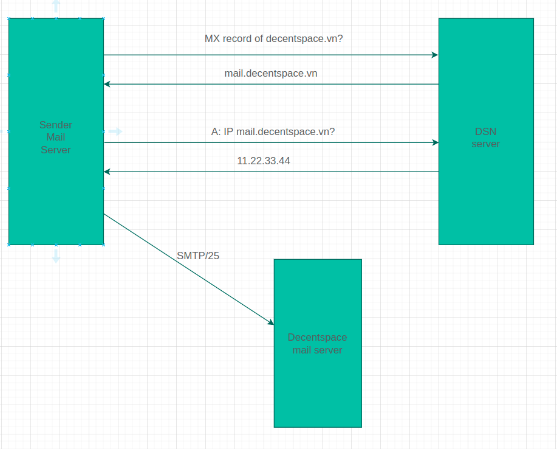
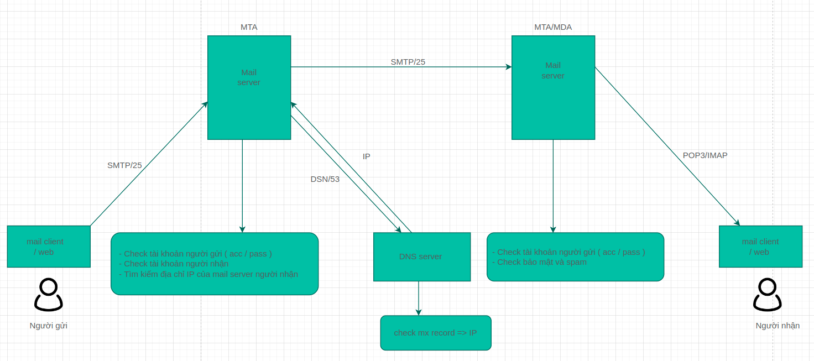

# **Mail serivce : Servie này sẽ xử lý việc gửi và nhận email của hệ thống**
## **I. Các thành phần của một email**
### **1. Địa chỉ email**
- Cấu trúc ( theo chuẩn rfc2821, độ dài tối đa của một địa chỉ email là 254 kí tự )
    - Tên định dạng : là tên để người khác xác định email này là của ai ( thường không được sử dụng )
    - Tên email : tên hộp thư, là duy nhất
    - Tên miền : tên nơi cung cấp dịch vụ thư điện tử ( sau dấu @ )
```
Hiệp Nguyễn nch@gmail.com
- Tên định dạng : Hiệp Nguyễn
- Tên email : nch
- Tên miền :  gmail.com
```

### **2. Cấu trúc của một email**
- Gồm 3 phần 
    - Envelop 
    - Header
    - Body

#### **Email message : Gồm 2 phần là header và body**
#### 2.1 Email header
- Không hiển thị trực tiếp tất cả các trường, chi tiết được thể hiện trong metadata 
    
- Các trường trong metadata
    * From : nơi email được tạo ra
    - Sender : người gửi email
    - To  nơi nhận email
    - CC : chế độ được sử dụng để gửi email cho nhiều người cùng lúc, danh sách những người nhận được nội dung mail cũng được hiển thị công khai với tất cả những người được nhận mail.
    - BCC : giống với CC  nhưng họ sẽ không biết được danh sách những người cùng nhận được thư chung với mình.
    - Subject : tiêu đề
    - Date : thời gian tạo email
    - Return-Path (Reply-To) :  khi trả Lời, ta sẽ trả lời tới địa chỉ email được chỉ định ở đây
    - Content type : dạng của email (text, HTML, ...)
    - Message-ID 
    - Một số trường khác
#### 2.2 Email body : chứa nội dung của email, các message, các file đính kèm 

## II. Tại sao cần sử dụng mail service và sử dụng khi nào?
### 1. Lí do sử dụng mail service : Kiểm soát việc gửi và nhận mail 
- Cho phép người dùng khi gửi mail và nhận mail trực tiếp thông qua Internet với tên miền của cụ thể 
- Khả năng hạn chế được các Mail spam và Virus trước khi chuyển tiếp tới người nhận bởi nhận dạng được IP của người gửi
- Bảo mật được thông tin nội bộ
- Người dùng có thể gửi và nhận mail thông qua Mail Client và Web mail
- Hệ thống mail có tính bảo mật cao nhờ sự cấu hình và cài đặt của quản trị viên
- Thiết lập dung lượng tối đa cho từng user sử dụng mail
- Quản lý được tất cả nội dung của tất cả mail
- Cấu hình chức năng tự động sao lưu dữ liệu gửi và nhận

### 2. Khi nào sử dụng mail service : sử dụng trong một số trường hợp : user đăng kí, thay đổi mật khẩu, nạp tiền vào ví , ...

## III. Các thành phần tham gia vào quá trình gửi và nhận mail 

### 3.1 MUA ( Mail User Agent )
- Ứng dụng khách cho phép nhận và gửi email
- Có thể là một ứng dụng dành cho máy tính để bàn như Microsoft Outlook / Thunderbird /… hoặc dựa trên web như Gmail / Hotmail /… (sau này còn được gọi là Webmail)
- Các ứng dụng máy tính còn có thể gọi với tên gọi khác là các mail client 

### 3.2 MSA ( Mail Submission Agent)
- Một chương trình máy chủ nhận thư từ MUA, kiểm tra bất kỳ lỗi nào và chuyển nó (bằng SMTP) đến MTA được lưu trữ trên cùng một máy chủ.

### 3.3 MTA (Mail Transfer Agent)
- Một ứng dụng máy chủ nhận thư từ MSA hoặc từ một MTA khác
- Nó sẽ tìm (thông qua máy chủ định danh và DNS) bản ghi MX từ vùng DNS của miền người nhận để biết mail của người nhận có tồn tại hay không
- Nếu có nó sẽ tìm kiếm mail server của người nhận và chuyển mail về đó qua SMTP hoặc, nếu máy chủ của người nhận đã được truy cập, nó sẽ chuyển đến MDA.

### 3.4 MDA (Mail Delivery Agent)
- Một chương trình máy chủ nhận thư từ MTA của máy chủ và lưu trữ nó vào hộp thư
- Còn được gọi là LDA (Local Delivery Agent)

### 3.5 Mailbox: maildir/mbox
- Nơi lưu trữ  mail của server
- Maildir là một cách lưu trữ email. Nó thường được ưu tiên hơn mbox

### 3.6 MX (Mail Exchanger) record
## **Các giao thức trong quá trình gửi và nhận email**
### 3.7 Giao thức gửi thư SMTP (Simple Mail Transfer Protocol)
- Giao thức chuẩn TCP/IP được dùng để truyền tải thư điện tử (e-mail) trên mạng internet
- Nó thiết lập kênh kết nối giữa MUA và mail server, và thiết lập kênh liên lạc giữa mail server gửi và mail server nhận
- Các port mặc định của SMTP:
    - Port 25 – port không mã hóa
    - Port 465/587 – SSL/TLS port, cũng có thể được gọi là SMTPS

### 3.8 Giao thức nhận mail POP3 và IMAP (Internet Message Access Protocol)
### 3.8.1 POP3 ( Post Office Protocol version 3 ) 
- Sử dụng để kết nối tới server email và tải email xuống máy tính cá nhân thông qua một ứng dụng email client 
- **Cơ chế hoạt động của POP**
    - Kết nối đến server mail
    - Nhận mail
    - Lưu cục bộ như mail mới
    - Xóa mail trên server
    - Ngắt kết nối với server
    - Là phương thức 1 chiều ( tức là thay đổi ở mail client sẽ không xuất hiện thay đổi trên mail server)
- **Ưu điểm của POP3**
    - Mail được lưu cục bộ, tức luôn có thể truy cập ngay cả khi không có kết nối Internet
    - Kết nối Internet chỉ dùng để gửi và nhận mail
    - Tiết kiệm không gian lưu trữ trên server
    - Được lựa chọn để lại bản sao mail trên server
    - Hợp nhất nhiều tài khoản email và nhiều server vào một hộp thư đến
- **Nhược điểm của POP3**
    - Mỗi lần nhận mail, POP sẽ download email đó về máy (và mặc định xóa mail trên server đi) nên ta sẽ không thể sử dụng nhiều thiết bị để quản lý cùng một tài khoản email qua giao thức POP.
    - Tuy nhiên, ta có thể cấu hình email client để POP3 không xóa email trên server mà chỉ “mask as read” – đánh dấu đã đọc với những email đó.

- **Port mặc định của POP3**
    - Port 110 – port không mã hóa
    - Port 995 – SSL/TLS port, cũng có thể được gọi là POP3S

### 3.8.2 IMAP (Internet Message Access Protocol)
- **Cơ chế hoạt động của IMAP**
    - Kết nối đến server
    - Lấy nội dung được yêu cầu từ người dùng và lưu đệm cục bộ (chẳng hạn như danh sách mail mới, tổng kết tin nhắn hay nội dung của những email được chọn lựa kỹ càng)
    - Xử lý các biên tập từ người dùng, ví dụ như đánh dấu email là mail để đọc hay xóa…
    - Ngắt kết nối với server
- **Ưu điểm của IMAP**
    - Mail được lưu trên server, tức có thể truy cập từ nhiều địa điểm khác nhau
    - Xem nhanh hơn khi chỉ có các tiêu đề mail được tải về đến khi nội dung được yêu cầu rõ ràng
    - Mail được dự phòng tự động trên server
    - Tiết kiệm không gian lưu trữ cục bộ.Vẫn cho phép lưu mail cục bộ (nếu cấu hình)
- **Nhược điểm của IMAP**
    - Vì IMAP lưu các email trên mail server, nên dung lượng hòm thư của sẽ bị giới hạn bởi các nhà cung cấp dịch vụ mail.
- Là kênh liên lạc 2 chiều, thay đổi trên mail client sẽ được chuyển lên server
- Ngoài ra, nếu sử dụng IMAP thì bạn cần phải có kết nối Internet nếu muốn truy cập email (IMAP chỉ kéo email headers về, nội dung email vẫn còn trên server).

- **Port mặc định của IMAP**
    - Port 143 – port không mã hóa
    - Port 993 – SSL/TLS port, cũng có thể được gọi là IMAPS

[Tài liệu tham khảo](https://afreshcloud.com/sysadmin/mail-terminology-mta-mua-msa-mda-smtp-dkim-spf-dmarc)

## **IV. MX record**
### **4.1 MX record là gì?**
- Bản ghi MX (Mail Exchange Record) là một phần của DNS dùng để xác định địa chỉ máy chủ mail cho một tên miền
- Máy chủ thư khác muốn liên lạc lại với email server của ta thì nó cần tìm bản ghi MX
- Bản ghi MX không nhất thiết phải trỏ đến VPS, hosting, server của doanh nghiệp. Khi ta dùng dịch vụ mail của bên thứ 3 thì ta sẽ sử dụng bản ghi MX do họ cung cấp
- Một tên miền có thể gán nhiều bản ghi MX
- Mục đích của nhiều bản ghi MX :
    - Đảm bảo sự cân bằng bằng cách sử dụng nhiều bản ghi MX cho cùng một tên miền 
    - Cung cấp bản ghi MX dự phòng có thể được sử dụng nếu MX chính không khả dụng
    - MX dự phòng có thể là một máy chủ khác trong hệ thống hoặc nó có thể là một máy chủ được lưu trữ bởi bên thứ ba cung cấp dịch vụ MX dự phòng

### **4.2 Cấu trúc của một mx record**
- Cấu trúc 
```
[domain_name] IN MX [priority] [mail-host]
decentspace.vn IN MX 1 mail.decentspace.vn
decentspace.vn IN MX 2 mail.1.decentspace.vn
```
- priority : biểu thị ưu tiên, giá trị 'ưu tiên' càng thấp thì độ ưu tiên càng cao
- mail-host : địa chỉ máy chủ sẽ xử lý mail, địa chỉ này bắt buộc phải là tên (không phải IP), và đã có một bản ghi A 
- Bản ghi A là bản ghi đi kèm với mx record, nó sẽ xác định địa chỉ IP của tên miền

### **4.3 MX record hoạt động như thế nào?**
- Ta cũng có thể hiểu MX record là một loại bản ghi DNS
- Ta vẫn luôn biết chức năng của DNS là dịch tên miền thành địa chỉ IP
- Ví dụ khi nhập  www.microsoft.com vào browser, DNS sẽ xác định địa chỉ IP của máy chủ cần truy cập, tên miền trong ví dụ này là microsoft.com
#### **Trong trường hợp ta gửi một email đến địa chỉ @decentspace.vn thì DNS sẽ làm gì?**
- Khi gửi thư MTA sẽ gửi một truy vấn DNS để xác định các máy chủ của tên miền decentspace.vn
- MTA thiết lập kết nối với các máy chủ đó để lấy được địa chỉ IP của máy chủ , bắt đầu với các miền được ưu tiên
- MTA thiết lập kết nối STMP đến địa chỉ IP đó và gửi thư


# Quy trình gửi và nhận email


## Tài liệu tham khảo
#### [MTA là gì](https://tinomail.com/mta-trong-email-la-gi/#:~:text=MTA%20l%C3%A0%20t%E1%BB%AB%20vi%E1%BA%BFt%20t%E1%BA%AFt,th%E1%BB%A9c%20truy%E1%BB%81n%20tin%20%C4%91%C6%A1n%20gi%E1%BA%A3n.)

#### [What is an MX record?](https://www.cloudflare.com/learning/dns/dns-records/dns-mx-record/#:~:text=A%20DNS%20'mail%20exchange'%20(,always%20point%20to%20another%20domain)

#### [ What is an MX Record, and How Do They Work?](https://practical365.com/mx-record/)


#### [Detail mail header](https://mxtoolbox.com/EmailHeaders.aspx)